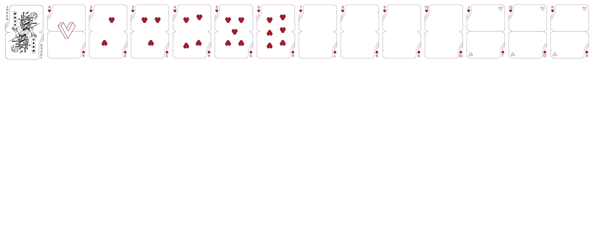

# Open Stellar Kingdoms

*Abandonware sci-fi playing cards deck*

A project to reverse trace and contribute to the public domain svg data from https://www.kickstarter.com/projects/stellarkingdoms/stellar-kingdoms-original-sci-fi-playing-cards using open source tools.

Current status: creating border layouts, core symbols, and numbered card positions

Starting with hearts

TODO: Accurate and dual layer tracing of face card illustrations