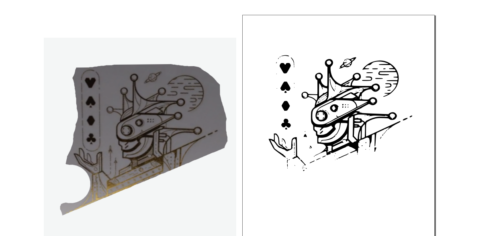
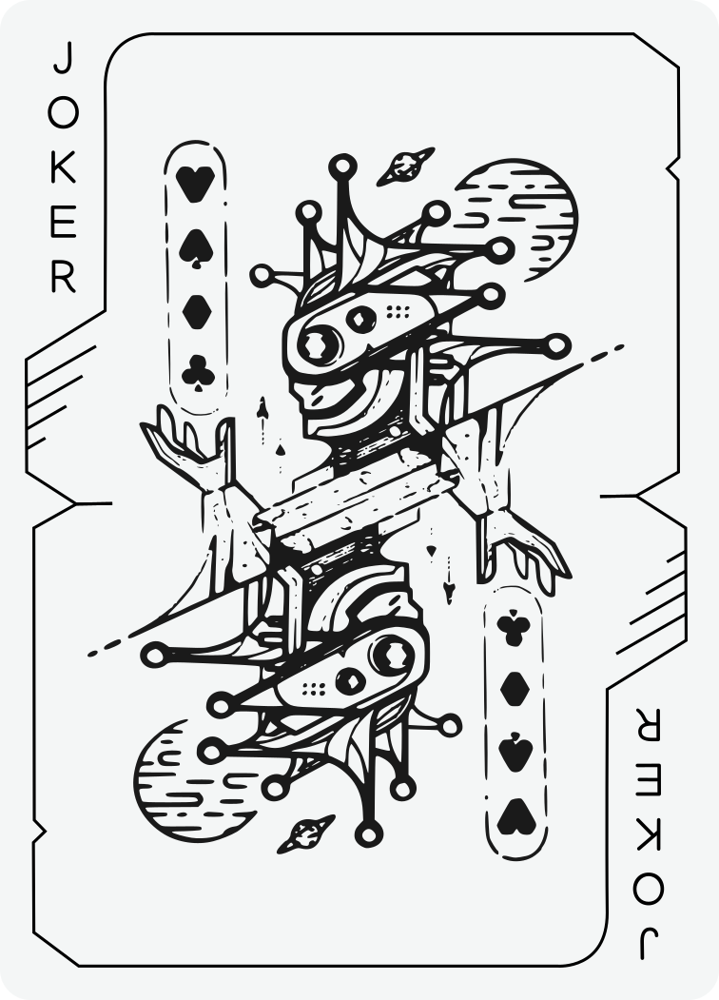

# Open Stellar Kingdoms
Current status: creating border layouts, core symbols, and numbered card positions
TODO: Accurate and dual layer tracing of face card illustrations

An attempt to reverse engineer and make public the svg data from the cards of Kickstarter scam https://www.kickstarter.com/projects/stellarkingdoms/stellar-kingdoms-original-sci-fi-playing-cards using open source tools